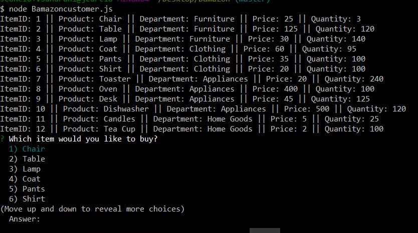

# Bamazon

To run the script, you will need to install the 'mysql' and 'inquirer' npm packages
```
$ npm install mysql --save 
```

```
$ npm install inquirer --save
```

To begin the program run this command,
```
$ node BamazonCustomer.js
```

If you want to exit the program at any time, press ```CTRL + c``` twice


When you first run the program, a list of available items will be displayed and you will be prompted with questions regarding a purchase.



After selecting a valid item and quantity, you will be given the total cost.


An updated table of items will be displayed again if you want to continue with another purchase.

If you try to purchase an amount greater than the current stock quantity, your purchase will not be processed and you will need to  order again.


##Bamazon Manager
To begin the program run this command,
```
node BamazoManager.js
```


If you want to exit the program at any time, press ```CTRL + c``` twice

When you first run the program you will be prompted to select an action based upon a list of actions. 


Selecting the first option will bring up a list of products for sale and then will prompt the user for further actions. 


Selecting the second option will provide a list of all current items with a Stock Quantity less than or equal to 5. 


Selecting the third option will prompt the user to select an item then input the amount to increase Stock Quantity of selected item. It then prints the current inventory to console and prompts for further action. 


Selecting the final option allows for creation of a new item into the inventory. The user is prompted to enter all pertinent fields. 


